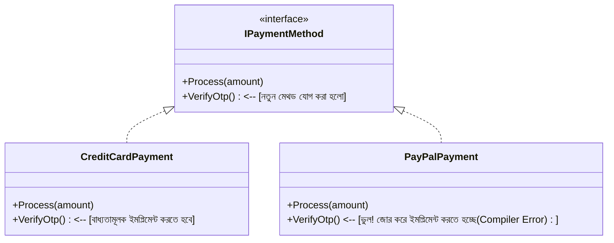
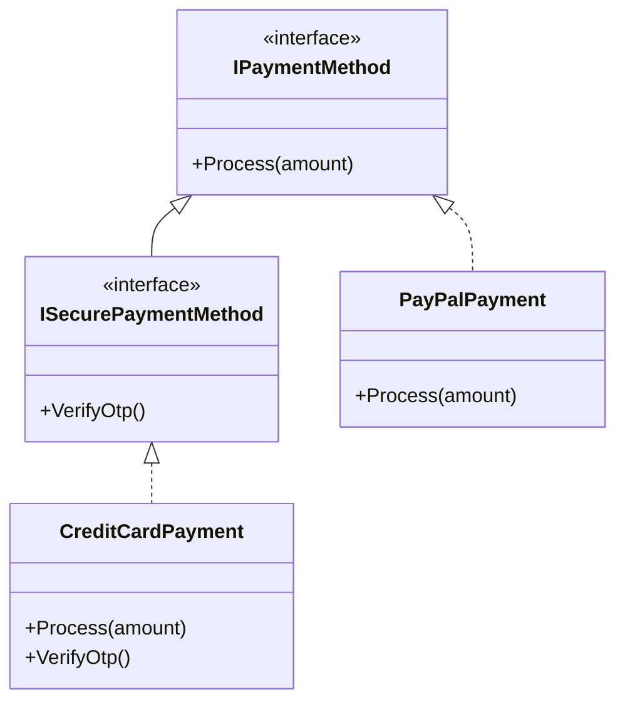
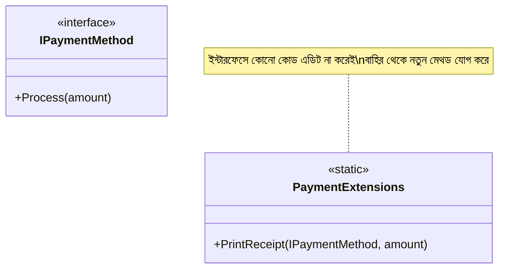
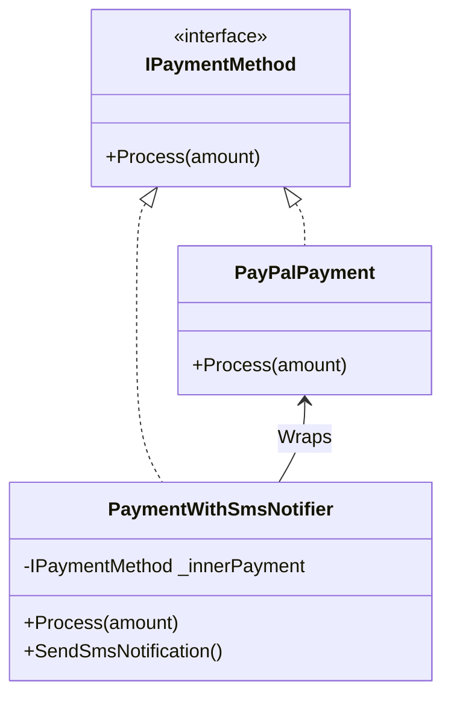

# Open-Closed Principle (OCP)

Software entities (classes, modules, functions, etc.) should be open for extension, but closed for modification.

This means you should be able to extend a class's behavior without modifying its existing source code.

---

## 🛑 The Violation

Take a look at [Violation.cs](file:///Users/bedata/Desktop/Learning/SOLID/02-open-closed-principle/Violation.cs).

Instead of using interfaces, we have concrete classes like `CreditCardPayment` and `PayPalPayment`. In `PaymentProcessor`, we receive the payment object as a generic `object` and use type checking (`is` keyword) to process it:
```csharp
if (payment is CreditCardPayment cardPayment) { ... }
else if (payment is PayPalPayment payPalPayment) { ... }
```
If we want to add a new payment method (e.g. `BkashPayment`), we must modify the `PaymentProcessor` class to add another `else if` check. This violates OCP because the class is not closed for modification.

## 🟢 The Solution

Take a look at [Solution.cs](file:///Users/bedata/Desktop/Learning/SOLID/02-open-closed-principle/Solution.cs).

We solve this by defining a shared **`IPaymentMethod` interface** with a polymorphic `Process(amount)` method. 
The `PaymentProcessor` now simply calls `paymentMethod.Process(amount)`. It doesn't know (or care) which concrete class is being used. Adding `BkashPayment` is done by creating a new class implementing `IPaymentMethod`, leaving the `PaymentProcessor` code 100% untouched.

---

## 💡 Clearing Common Misconceptions & FAQ (প্রশ্ন ও উত্তর)

Here are the answers to your questions regarding OCP:

### ১. প্রশ্ন: কোডে বাগ (Bug) থাকলে কি ক্লাস পরিবর্তন করা যাবে? (Can we modify a class to fix a bug?)

**উত্তর (Yes, absolutely):**
* **OCP মানে এই নয় যে বাগ ফিক্স করা যাবে না।** ওল্ড কোডে কোনো বাগ থাকলে সেটা ফিক্স করার জন্য অবশ্যই আপনি মূল ক্লাসের কোড পরিবর্তন করবেন। 
* OCP-র মূল উদ্দেশ্য হলো **নতুন ফিচার (Feature) বা আচরণ (Behavior)** যোগ করার সময় যেন পুরোনো ও ভালোমতো কাজ করা কোডে হাত দিতে না হয়। বাগ ফিক্সিং হচ্ছে ভুল কোডকে ঠিক করা, কোনো নতুন ফিচার অ্যাড করা নয়। তাই বাগ ফিক্স করার জন্য নিশ্চিন্তে কোড পরিবর্তন করতে পারবেন।

---

### ২. প্রশ্ন: নতুন মেথড অ্যাড করতে গেলে কি ইন্টারফেস পরিবর্তন করতে হবে? (Do we have to change the interface to add a new method?)

**উত্তর:**
যদি আপনি ইন্টারফেসে সরাসরি একটি মেথড যোগ করেন, তবে ওই ইন্টারফেসটি যারা ইমপ্লিমেন্ট করেছে (যেমন `CreditCardPayment`, `PayPalPayment`), তাদের সবার ভেতরেই ওই নতুন মেথডটি জোরপূর্বক ইমপ্লিমেন্ট করতে হবে। এটি ওল্ড কোড ব্রেক করে।

নিচে ডায়াগ্রাম ও বিস্তারিত ব্যাখ্যা দেওয়া হলো:

#### ❌ সমস্যা (The Problem Diagram)
যদি আমরা সরাসরি `IPaymentMethod` ইন্টারফেসে `VerifyOtp()` নামক একটি নতুন মেথড যোগ করি:



* **কেন সমস্যা?** ক্রেডিট কার্ডের জন্য ওটিপি (OTP) দরকার হলেও পেপ্যালের (PayPal) জন্য ওটিপি দরকার নেই। কিন্তু ইন্টারফেসে মেথড যোগ করায় পেপ্যাল ক্লাসে কম্পাইলার এরর (Compiler Error) দেবে এবং বলবে `VerifyOtp()` ইমপ্লিমেন্ট করো। অর্থাৎ আমাদের পেপ্যাল ক্লাসের সোর্স কোড জোর করে মডিফাই করতে হচ্ছে, যা OCP লঙ্ঘন করে।

---

### 💡 এই সমস্যা এড়ানোর ৩টি উপায় (Solutions):

#### উপায় ১: ইন্টারফেস ইনহেরিটেন্স (Interface Inheritance)
আগের ইন্টারফেসে হাত না দিয়ে, একটি নতুন ইন্টারফেস তৈরি করব যা পুরাতন ইন্টারফেসকে ইনহেরিট (Inherit) করে।



* **কেন ভালো?** `PayPalPayment` ক্লাসটি আগের মতোই শুধু `IPaymentMethod` ইমপ্লিমেন্ট করে থাকবে, তাকে টাচও করতে হবে না। আর যে ক্লাসের ওটিপি ভেরিফিকেশন লাগবে (যেমন `CreditCardPayment`), সে নতুন ইন্টারফেস `ISecurePaymentMethod` ইমপ্লিমেন্ট করবে।

---

#### উপায় ২: এক্সটেনশন মেথড (Extension Methods)
ইন্টারফেস বা কনক্রিট ক্লাস কোনো কিছুতেই কোড না লিখে, একদম আলাদা একটি ফাইলে সি-শার্পের Extension Method ব্যবহার করে মেথড যোগ করা।



* **কোড উদাহরণ:**
```csharp
public static class PaymentExtensions
{
    // this IPaymentMethod ব্যবহার করায় এটি সরাসরি মেথডের মতো কল করা যাবে
    public static void PrintReceipt(this IPaymentMethod paymentMethod, decimal amount)
    {
        Console.WriteLine($"Receipt printed for {amount}");
    }
}
```
* **ব্যবহার:** `paypalPayment.PrintReceipt(500);`
* **কেন ভালো?** `IPaymentMethod` বা এর কোনো ক্লাসে একটি লাইনের কোডও পরিবর্তন করতে হলো না, অথচ আমরা একটি নতুন কাজ/মেথড পেয়ে গেলাম!

---

#### উপায় ৩: ডেকোরেটর প্যাটার্ন (Decorator Pattern)
বিদ্যমান ক্লাসের কোনো কোড না বদলে, তার চারদিকে একটি "র‍্যাপার" বা কভার ক্লাস তৈরি করে নতুন দায়িত্ব যোগ করা।



* **কেন ভালো?** আমরা পেপ্যাল পেমেন্ট হওয়ার পর একটি SMS নোটিফিকেশন পাঠাতে চাই। আমরা `PayPalPayment` ক্লাসে হাত না দিয়ে `PaymentWithSmsNotifier` নামক একটি নতুন ক্লাস বানালাম, যা ভেতরে অন্য পেমেন্ট মেথডকে রান করে এবং সাথে বাড়তি কাজ (SMS পাঠানো) সম্পন্ন করে।

---

### ৩. প্রশ্ন: যদি একটি ইন্টারফেস কেবল একটি ক্লাসেই ইমপ্লিমেন্ট করা থাকে, তবে কি নতুন মেথড সরাসরি ইন্টারফেসে যোগ করা যাবে? এটি কি OCP লঙ্ঘন করে?

**উত্তর:**
* **তাত্ত্বিক (Theoretical) দৃষ্টিকোণ থেকে:** হ্যাঁ, এটি OCP লঙ্ঘন করে। কারণ আপনি সরাসরি ইন্টারফেস এবং কনক্রিট ক্লাসের সোর্স কোড মডিফাই করছেন।
* **বাস্তব বা প্র্যাক্টিক্যাল (Practical) দৃষ্টিকোণ থেকে:** **না, এটি কোনো ক্ষতিকর সমস্যা নয় এবং এটি করা সম্পূর্ণ ঠিক আছে।**
  * OCP-এর মূল উদ্দেশ্য হলো একটি নতুন পরিবর্তনের কারণে যেন অন্য কোনো বিদ্যমান কোড ব্রেক না করে। যেহেতু ইন্টারফেসটি কেবল একটি ক্লাসই ইমপ্লিমেন্ট করেছে (যেমন Dependency Injection-এর জন্য `IUserService` ও `UserService`), তাই ইন্টারফেসে নতুন মেথড যোগ করলে অন্য কোনো ক্লাস ব্রেক হওয়ার সুযোগ নেই।
  * তাই বাস্তব প্রজেক্টে এ ধরনের ১-টু-১ (1-to-1) সম্পর্কের ক্ষেত্রে সরাসরি মেথড যোগ করা একটি সাধারণ এবং সঠিক প্র্যাকটিস।
