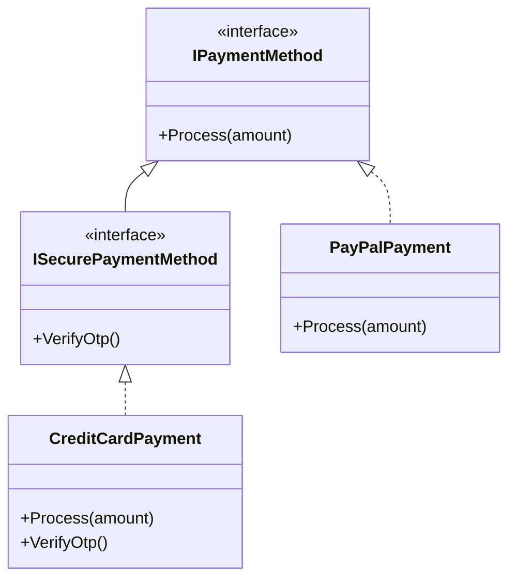
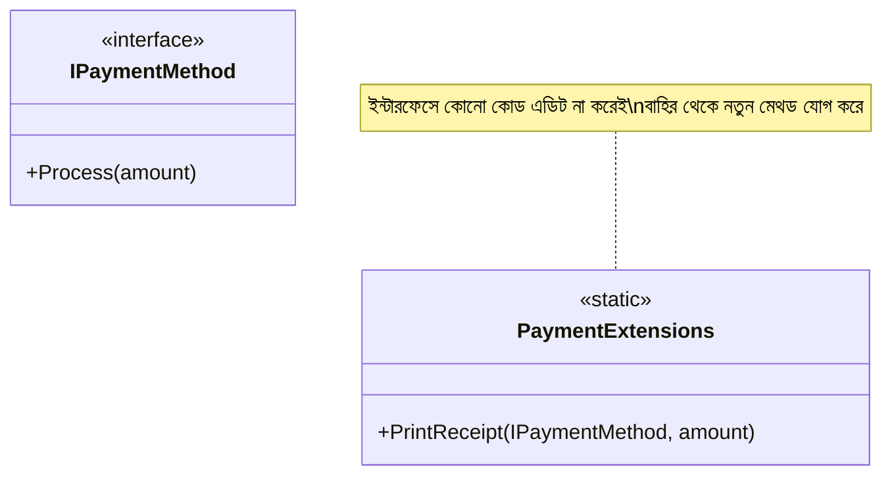
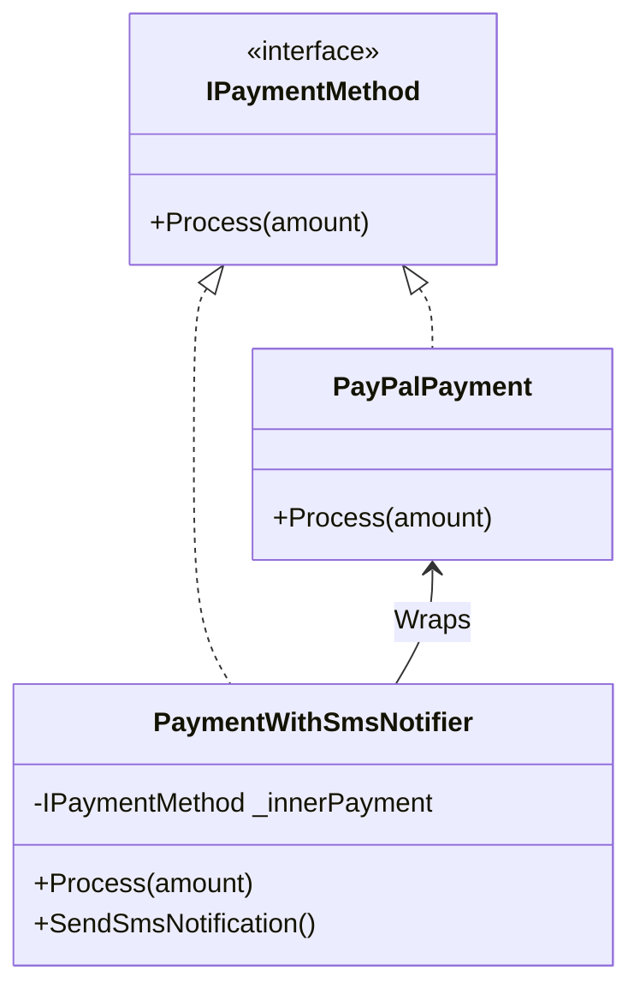

# Open-Closed Principle (OCP)

Software entities (classes, modules, functions, etc.) should be open for extension, but closed for modification.

This means you should be able to extend a class's behavior without modifying its existing source code.

---

## 🛑 The Violation

Take a look at [Violation.cs](file:///Users/bedata/Desktop/Learning/SOLID/02-open-closed-principle/Violation.cs).

Instead of using interfaces, we have concrete classes like `CreditCardPayment` and `PayPalPayment`. In `PaymentProcessor`, we receive the payment object as a generic `object` and use type checking (`is` keyword) to process it:
```csharp
if (payment is CreditCardPayment cardPayment) { ... }
else if (payment is PayPalPayment payPalPayment) { ... }
```
If we want to add a new payment method (e.g. `BkashPayment`), we must modify the `PaymentProcessor` class to add another `else if` check. This violates OCP because the class is not closed for modification.

---

## 🟢 The Solution

Take a look at [Solution.cs](file:///Users/bedata/Desktop/Learning/SOLID/02-open-closed-principle/Solution.cs).

We solve this by defining a shared **`IPaymentMethod` interface** with a polymorphic `Process(amount)` method. 
The `PaymentProcessor` now simply calls `paymentMethod.Process(amount)`. It doesn't know (or care) which concrete class is being used. Adding `BkashPayment` is done by creating a new class implementing `IPaymentMethod`, leaving the `PaymentProcessor` code 100% untouched.

---

## 💡 Clearing Common Misconceptions & FAQ (প্রশ্ন ও উত্তর)

Here are the answers to your questions regarding OCP:

### ১. প্রশ্ন: কোডে বাগ (Bug) থাকলে কি ক্লাস পরিবর্তন করা যাবে? (Can we modify a class to fix a bug?)

**উত্তর (Yes, absolutely):**
* **OCP মানে এই নয় যে বাগ ফিক্স করা যাবে না।** ওল্ড কোডে কোনো বাগ থাকলে সেটা ফিক্স করার জন্য অবশ্যই আপনি মূল ক্লাসের কোড পরিবর্তন করবেন। 
* OCP-র মূল উদ্দেশ্য হলো **নতুন ফিচার (Feature) বা আচরণ (Behavior)** যোগ করার সময় যেন পুরোনো ও ভালোমতো কাজ করা কোডে হাত দিতে না হয়। বাগ ফিক্সিং হচ্ছে ভুল কোডকে ঠিক করা, কোনো নতুন ফিচার অ্যাড করা নয়। তাই বাগ ফিক্স করার জন্য নিশ্চিন্তে কোড পরিবর্তন করতে পারবেন।

---

### ২. প্রশ্ন: নতুন ফিচার যোগ করার সময় বিদ্যমান ইন্টারফেসে সরাসরি নতুন মেথড সিগনেচার যোগ করা কি OCP লঙ্ঘন (Violation)?

**উত্তর (হ্যাঁ, এটি সরাসরি OCP লঙ্ঘন):**
* যদি আপনি একটি বিদ্যমান ইন্টারফেসে (যেমন `IPaymentMethod`) সরাসরি নতুন মেথড সিগনেচার যোগ করেন, তবে ওই ইন্টারফেস ব্যবহারকারী প্রতিটি ক্লাসকে (যেমন `PayPalPayment` এবং `CreditCardPayment`) মডিফাই করে সেই মেথডটি ইমপ্লিমেন্ট করতে হবে। 
* এর ফলে বিদ্যমান কাজের কোডগুলো জোরপূর্বক মডিফাই করতে হয়, যা ওল্ড কোড ব্রেক করতে পারে। এটিই হলো ও সি পি (OCP) লঙ্ঘন।

---

### ৩. প্রশ্ন: তাহলে ইন্টারফেসের কোড মডিফাই না করে নতুন মেথড বা ফিচার কীভাবে যুক্ত করব? (Solutions)

আমাদের মূল ইন্টারফেস এবং বিদ্যমান ক্লাসগুলোকে **স্পর্শ না করে (Closed for Modification)** নতুন মেথড বা ফিচার যুক্ত করার ৩টি চমৎকার উপায় আছে:

#### উপায় ১: ইন্টারফেস ইনহেরিটেন্স (Interface Inheritance - Recommended OCP Extension)
আগের ইন্টারফেসে হাত না দিয়ে, একটি নতুন ইন্টারফেস তৈরি করব যা পুরাতন ইন্টারফেসকে ইনহেরিট (Inherit) করে।



* **কেন এটি সঠিক OCP?** 
  * মূল ইন্টারফেস `IPaymentMethod` সম্পূর্ণ অপরিবর্তিত থাকল।
  * `PayPalPayment` ক্লাসের সোর্স কোড আমাদের এডিট করতে হলো না। 
  * শুধুমাত্র যে ক্লাসের ওটিপি ভেরিফিকেশন লাগবে (যেমন `CreditCardPayment`), সে নতুন ইন্টারফেস `ISecurePaymentMethod` ইমপ্লিমেন্ট করবে।

---

#### উপায় ২: এক্সটেনশন মেথড (Extension Methods)
ইন্টারফেস বা কনক্রিট ক্লাস কোনো কিছুতেই কোড না লিখে, সি-শার্পের Extension Method ব্যবহার করে নতুন মেথড যুক্ত করা।



* **কোড উদাহরণ:**
```csharp
public static class PaymentExtensions
{
    // this IPaymentMethod ব্যবহার করায় এটি সরাসরি মেথডের মতো কল করা যাবে
    public static void PrintReceipt(this IPaymentMethod paymentMethod, decimal amount)
    {
        Console.WriteLine($"Receipt printed for {amount}");
    }
}
```
* **কেন এটি সঠিক OCP?** `IPaymentMethod` বা এর কোনো ক্লাসে একটি লাইনের কোডও পরিবর্তন করতে হলো না, অথচ আমরা একটি নতুন কাজ পেয়ে গেলাম!

---

#### উপায় ৩: ডেকোরেটর প্যাটার্ন (Decorator Pattern)
বিদ্যমান ক্লাসের কোনো কোড না বদলে, তার চারদিকে একটি "র‍্যাপার" বা কভার ক্লাস তৈরি করে নতুন দায়িত্ব যোগ করা।



* **কেন এটি সঠিক OCP?** আমরা পেপ্যাল পেমেন্ট হওয়ার পর একটি SMS নোটিফিকেশন পাঠাতে চাই। আমরা `PayPalPayment` ক্লাসে হাত না দিয়ে `PaymentWithSmsNotifier` নামক একটি নতুন ক্লাস বানালাম, যা ওল্ড কোড পরিবর্তন না করেই বাড়তি কাজ (SMS পাঠানো) সম্পন্ন করে।

---

### ৪. প্রশ্ন: যদি কোনো ইন্টারফেস কেবল একটি ক্লাসেই ইমপ্লিমেন্ট করা থাকে (1-to-1 relationship), তবে কি সরাসরি ইন্টারফেসে মেথড যোগ করা যাবে?

**উত্তর:**
* **তাত্ত্বিক দৃষ্টিকোণ থেকে:** হ্যাঁ, ওল্ড ফাইল এডিট করার কারণে এটি তাত্ত্বিকভাবে মডিফিকেশন।
* **বাস্তব বা প্র্যাক্টিক্যাল দৃষ্টিকোণ থেকে:** এটি করা সম্পূর্ণ ঠিক আছে। যেহেতু ইন্টারফেসটি কেবল একটি ক্লাসই ইমপ্লিমেন্ট করেছে (যেমন Dependency Injection-এর জন্য `IUserService` ও `UserService`), সেহেতু অন্য কোনো ক্লাস বা ফিচার ব্রেক হওয়ার সম্ভাবনা নেই। তাই বাস্তব প্রজেক্টে ১-টু-১ সম্পর্কের ক্ষেত্রে সরাসরি মেথড যোগ করা একটি সাধারণ ও সঠিক প্র্যাকটিস।
